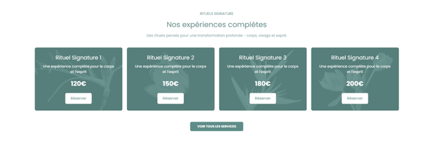

# Shopify Sections Library

A growing collection of custom, reusable Shopify Liquid sections — free to copy, customize, and use in your own theme.

Built and maintained by [Rubaeid](https://github.com/YOUR-USERNAME). Every section here was designed for real projects, cleaned up, and documented so anyone can drop it into their theme.

---

## 🔍 How to Use

1. Open the section folder you need (e.g. `sections/hero-banner/`)
2. Copy the `.liquid` file into your theme's `sections/` directory via Shopify CLI, Theme Kit, or the Shopify code editor
3. Read that section's own `README.md` for schema settings, dependencies, and customization notes
4. Adjust the schema settings from your theme customizer as needed

No attribution required, but a ⭐ on this repo is always appreciated.

---

## 📚 Sections

| Preview | Section | Description | Link |
|---|---|---|---|
|  | **Branding Grid** | Asymmetrical 5-image brand grid with a floating arched center portrait, plus a mobile stack/slider mode | [View](sections/branding-grid) |
|  | **Pricing Cards** | 4-card pricing/service grid with background images, overlays, and per-card CTAs, with a mobile swipe slider | [View](sections/pricing-cards) |
|  | **Rotating Testimonial** | 3D coverflow-style testimonial carousel with star ratings, verified badges, and prev/next navigation | [View](sections/rotating-testimonial) |
|  | **Meet the Dogs** | Compact storytelling card grid to introduce team members/pets with block-based cards and optional CTA | [View](sections/meet-the-dogs) |
|  | **Lifestyle Showcase** | Full-width image showcase with flexible card overlays, captions, and responsive layout options | [View](sections/lifestyle-showcase) |
|  | **Image with Text (Gradient BG)** | Image and text split layout with gradient background options and responsive stacking for mobile | [View](sections/image_with_text_gradient_BG) |

<!-- Add new rows above this line as you build new sections -->

---

## 🛠 Tech

- Shopify Liquid
- Vanilla JS / CSS (no framework dependencies unless noted per-section)
- Built and tested on Shopify Online Store 2.0 themes

## 📄 License

MIT — free to use, modify, and distribute.

## 🤝 Contributing

Found a bug or improved a section? PRs are welcome. Please follow the existing folder structure and include a preview image with any new section.
