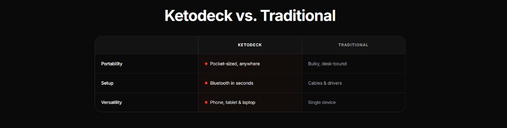

# Ketodeck vs. Traditional

A modern cyberpunk-inspired comparison table section for Shopify Online Store 2.0 themes. Built to contrast a hero product against traditional alternatives, featuring glowing neon laser dot indicators, dark rounded card styling with hairline dividers, customizable column headers, and a mobile-optimized responsive layout.

---

## ✨ Features

- **Dark Cyberpunk Card Wrapper**: Sleek rounded container (`border-radius: 20px`) with subtle dark background and hairline borders (`1px solid rgba(255, 255, 255, 0.08)`).
- **Glowing Laser Dot Indicators**: Vibrant crimson laser dots (`#ef4444`) with ambient box-shadow glow and optional pulse animation to highlight product advantages.
- **Structured 3-Column Matrix**:
  - **Feature / Attribute**: Clear labels for comparison criteria (e.g. *Portability*, *Setup*, *Versatility*).
  - **Primary Product Column**: High-contrast white text with glowing dot indicators and optional column highlight tint.
  - **Traditional / Competitor Column**: Elegant dimmed neutral gray text (`#9ca3af`) for competitor drawbacks.
- **Customizable Column Headers**: Monospace or sans-serif uppercase tracking headers (e.g. `KETODECK` and `TRADITIONAL`).
- **Smooth Row Hover Effects**: Subtle interactive background highlight on hover for enhanced user engagement.
- **Repeater Row Blocks**: Add, remove, or reorder comparison rows anytime from the Shopify theme editor.
- **Mobile Responsive**: Built-in horizontal scroll wrapper with custom subtle scrollbar ensures tables remain readable on all mobile screens without layout breaking.
- **Accessible Structure**: Accessible HTML table markup with semantic caption, scope attributes, and ARIA labels.
- **Zero Dependencies**: Pure HTML and CSS — no JavaScript or third-party libraries required.

---

## 🚀 How to Use

1. Copy [`ketodeck-vs-traditional.liquid`](ketodeck-vs-traditional.liquid) into your Shopify theme's `sections/` folder.
2. In the Shopify theme customizer, navigate to any template (Product page, Landing page, Home page, etc.).
3. Click **Add section** and search for **Ketodeck vs Traditional**.
4. Customize the heading, column titles, colors, and add comparison rows as needed.

---

## ⚙️ Schema Settings

### Section Settings

| Setting | Type | Default | Description |
|---|---|---|---|
| `section_bg` | `color` | `#000000` | Background color for the section |
| `container_max_width` | `range` | `1040px` | Maximum container width |
| `padding_top_desktop` / `padding_bottom_desktop` | `range` | `96px` | Vertical padding on desktop |
| `padding_top_mobile` / `padding_bottom_mobile` | `range` | `56px` | Vertical padding on mobile |
| `heading` | `text` | `Ketodeck vs. Traditional` | Main section heading text |
| `heading_tag` | `select` | `h2` | HTML heading tag (`h1`, `h2`, `h3`, `div`) |
| `heading_alignment` | `select` | `center` | Text alignment (`center`, `left`) |
| `heading_color` | `color` | `#ffffff` | Heading text color |
| `heading_font_size_desktop` / `_mobile` | `range` | `40px` / `28px` | Responsive heading font size |
| `heading_font_family` | `select` | `default` | Default Sans, Theme Heading, or Theme Body |
| `heading_margin_bottom` | `range` | `48px` | Bottom margin below heading |
| `subheading` | `text` | `""` | Optional subheading text |
| `col_1_header` | `text` | `""` | Optional header for feature column |
| `col_2_header` | `text` | `KETODECK` | Header for primary product column |
| `col_2_header_color` | `color` | `#ffffff` | Color for primary column header |
| `col_3_header` | `text` | `TRADITIONAL` | Header for secondary/competitor column |
| `col_3_header_color` | `color` | `#9ca3af` | Color for secondary column header |
| `header_alignment` | `select` | `center` | Column headers alignment (`center`, `left`) |
| `header_font_size` | `range` | `13px` | Font size for column headers |
| `header_letter_spacing` | `range` | `2px` | Tracking / letter spacing for column headers |
| `card_bg_color` | `color` | `#0e0e11` | Table card background color |
| `card_border_color` | `color` | `rgba(255, 255, 255, 0.08)` | Outer card border color |
| `card_border_radius` | `range` | `20px` | Border radius of the table card |
| `divider_color` | `color` | `rgba(255, 255, 255, 0.08)` | Hairline divider line color between rows/columns |
| `row_hover_bg` | `color` | `rgba(255, 255, 255, 0.02)` | Background color of rows on hover |
| `highlight_primary_col` | `checkbox` | `false` | Enable subtle ambient background on primary column |
| `primary_col_bg` | `color` | `rgba(239, 68, 68, 0.02)` | Tint color for primary column highlight |
| `cell_padding_y_desktop` / `_mobile` | `range` | `22px` / `16px` | Vertical cell padding |
| `cell_padding_x_desktop` / `_mobile` | `range` | `32px` / `16px` | Horizontal cell padding |
| `show_dots` | `checkbox` | `true` | Toggle glowing indicator dots |
| `dot_color` | `color` | `#ef4444` | Laser dot color |
| `dot_glow_color` | `color` | `rgba(239, 68, 68, 0.7)` | Laser dot outer glow color |
| `dot_size` | `range` | `8px` | Dot diameter |
| `pulse_animation` | `checkbox` | `true` | Enable subtle dot breathing pulse animation |
| `feature_color` / `feature_font_size` | `color` / `range` | `#ffffff` / `15px` | Feature label typography |
| `feature_font_weight` | `select` | `600` | Feature label font weight |
| `primary_value_color` / `_size` | `color` / `range` | `#ffffff` / `15px` | Primary value typography |
| `secondary_value_color` / `_size` | `color` / `range` | `#9ca3af` / `15px` | Secondary value typography |

### Block Settings (`comparison_row`)

| Setting | Type | Default | Description |
|---|---|---|---|
| `feature_name` | `text` | `Feature` | Name of the feature or attribute (e.g. `Portability`) |
| `primary_value` | `text` | `Pocket-sized, anywhere` | Value for the primary product |
| `show_dot` | `checkbox` | `true` | Show glowing dot for this specific row |
| `dot_color` | `color` | `transparent` | Optional custom dot color override for this row |
| `secondary_value` | `text` | `Bulky, desk-bound` | Value for the competitor / traditional product |

---

## 🎨 Presets Included

The section comes pre-configured with the 3 default comparison rows shown in the preview:
1. **Portability**: `Pocket-sized, anywhere` vs `Bulky, desk-bound`
2. **Setup**: `Bluetooth in seconds` vs `Cables & drivers`
3. **Versatility**: `Phone, tablet & laptop` vs `Single device`

---

## 💻 Tech & Compatibility

- **Shopify Compatibility**: Online Store 2.0 (OS 2.0)
- **Zero Dependencies**: Pure HTML and CSS
- **Performance**: Lightweight, hardware-accelerated transitions, zero layout shift
- **License**: MIT
