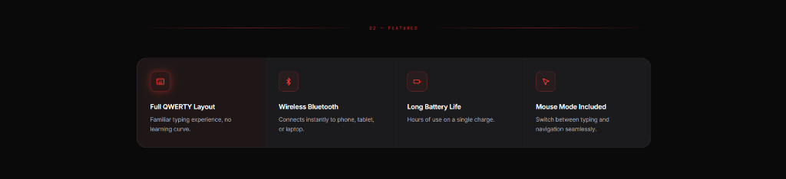

# Laser Features Grid

A cyberpunk-inspired dark feature grid for Shopify Online Store 2.0 themes. Features a glowing laser beam divider header, hairline-bordered dark grid cards (`gap-px` grid technique), customizable Lucide SVG icons, and a neon laser hover glow effect.

---

## ✨ Features

- **Cyber Laser Divider Header**: Centered uppercase monospace tag (`02 — FEATURES`) flanked by glowing horizontal laser beam lines.
- **Hairline Border Grid**: Uses a modern 1px background-gap grid trick with rounded outer corners (`border-radius: 24px`) to create seamless hairline dividers between cards.
- **Neon Glow Hover Effect**: Icon boxes feature a neon border, subtle background tint, and light up with a glowing shadow on hover (`glow-red-sm`).
- **Permanent Highlight Option**: Any card can be marked with a permanent glow state to emphasize primary selling points.
- **Built-in SVG Icon Library**: Includes 12 built-in SVG icons (`keyboard`, `bluetooth`, `battery`, `mouse_pointer`, `cpu`, `wifi`, `shield`, `zap`, `sparkles`, `star`, `check_circle`, `settings`).
- **Custom Icon Support**: Upload custom images or paste raw SVG code directly into any card block.
- **Optional Card Links**: Add an optional URL to any card to make the entire card clickable.
- **Responsive Layout**:
  - **Desktop**: Selectable 2, 3, or 4 columns
  - **Tablet**: Auto-adapts to 2 columns
  - **Mobile**: Selectable 1 or 2 columns
- **Zero External Dependencies**: 100% vanilla CSS and SVG, no third-party JavaScript or CSS frameworks needed.

---

## 🚀 How to Use

1. Copy [`laser-features-grid.liquid`](laser-features-grid.liquid) into your Shopify theme's `sections/` folder.
2. In the Shopify theme customizer, navigate to any template (Home page, Product page, Landing page, etc.).
3. Click **Add section** and search for **Laser Features Grid**.
4. Customize the colors, laser glow, tag text, and add/reorder feature cards as needed.

---

## ⚙️ Schema Settings

### Section Settings

| Setting | Type | Default | Description |
|---|---|---|---|
| `section_bg` | `color` | `#000000` | Section background color |
| `container_max_width` | `range` | `1280px` | Maximum container width |
| `padding_top_desktop` / `padding_bottom_desktop` | `range` | `112px` | Vertical padding on desktop |
| `padding_top_mobile` / `padding_bottom_mobile` | `range` | `64px` | Vertical padding on mobile |
| `show_header` | `checkbox` | `true` | Toggle the laser divider header |
| `tag_text` | `text` | `02 — Features` | Header tag text |
| `tag_color` | `color` | `rgba(239, 68, 68, 0.75)` | Header tag color |
| `tag_font_size` | `range` | `10px` | Header tag font size |
| `tag_letter_spacing` | `range` | `3px` | Header tag letter spacing |
| `tag_font_family` | `select` | `monospace` | Monospace, sans-serif, theme heading, or body font |
| `laser_color` | `color` | `#ef4444` | Laser line beam color |
| `laser_glow_color` | `color` | `rgba(239, 68, 68, 0.45)` | Laser line glow color |
| `columns_desktop` | `select` | `4` | Desktop columns (2, 3, or 4) |
| `columns_mobile` | `select` | `1` | Mobile columns (1 or 2) |
| `card_border_radius` | `range` | `24px` | Outer border radius of grid wrapper |
| `card_padding` | `range` | `32px` | Inner card padding |
| `card_bg_color` | `color` | `#111113` | Card background color |
| `card_hover_bg_color` | `color` | `rgba(239, 68, 68, 0.04)` | Card hover background color |
| `grid_gap_color` | `color` | `rgba(255, 255, 255, 0.08)` | 1px hairline divider color between cards |
| `grid_border_color` | `color` | `rgba(255, 255, 255, 0.12)` | Outer border color |
| `accent_color` | `color` | `#ef4444` | Icon color and hover accent |
| `icon_box_border_color` | `color` | `rgba(239, 68, 68, 0.3)` | Icon container border color |
| `icon_box_bg_color` | `color` | `rgba(239, 68, 68, 0.05)` | Icon container background |
| `icon_glow_color` | `color` | `rgba(239, 68, 68, 0.5)` | Neon glow shadow color on hover |
| `title_color` / `title_font_size` | `color` / `range` | `#ffffff` / `16px` | Title typography |
| `desc_color` / `desc_font_size` | `color` / `range` | `#9ca3af` / `14px` | Description typography |

### Block Settings (`feature_card`)

| Setting | Type | Description |
|---|---|---|
| `icon` | `select` | Built-in icon preset (`keyboard`, `bluetooth`, `battery`, `mouse_pointer`, `cpu`, `wifi`, `shield`, `zap`, `sparkles`, `star`, etc.) |
| `custom_svg` | `html` | Custom raw SVG code (overrides preset) |
| `custom_icon_image` | `image_picker` | Custom icon image upload |
| `title` | `text` | Card title heading |
| `description` | `textarea` | Card description text |
| `card_link` | `url` | Optional URL to make the whole card clickable |
| `enable_permanent_glow` | `checkbox` | Keeps the icon box glowing by default (great for highlighting a key feature) |

---

## 🎨 Presets Included

The section comes pre-configured with the 4 default features shown in the preview:
1. **Full QWERTY Layout** (Keyboard icon with permanent glow)
2. **Wireless Bluetooth** (Bluetooth icon)
3. **Long Battery Life** (Battery icon)
4. **Mouse Mode Included** (Mouse pointer icon)

---

## 💻 Tech & Compatibility

- **Shopify Compatibility**: Online Store 2.0 (OS 2.0)
- **Zero Dependencies**: Pure HTML, CSS, and SVG
- **Performance**: Lightweight, hardware-accelerated transitions, no layout shifts
- **License**: MIT
