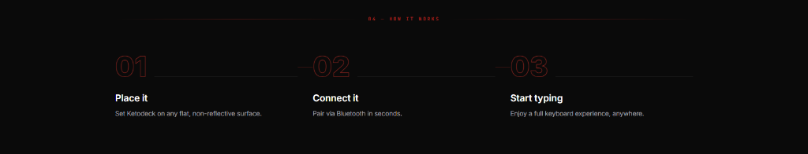

# Laser How It Works

A cyberpunk-inspired "How It Works" / Steps section for Shopify Online Store 2.0 themes. Features a glowing laser beam header, futuristic outlined neon stroke step numbers, connecting timeline lines across columns, and reactive neon glow hover effects.

---

## ✨ Features

- **Laser Divider Header**: Glowing horizontal laser lines with outer edge fade and center uppercase monospace tag (`04 — HOW IT WORKS`).
- **Outlined Neon Numbers**: Large futuristic step numbers with hollow stroke styling (`-webkit-text-stroke`) and subtle neon drop shadows.
- **Continuous Connecting Timeline**: Hairline connector lines running horizontally between each step across columns.
- **Interactive Neon Hover Effect**: On hover, the step number lights up with an intensified neon glow, and the connector lines illuminate with the laser accent color.
- **Automatic or Manual Numbering**: Automatic zero-padded numbering (`01`, `02`, `03`...) with manual override support per block.
- **Optional Step Links**: Add an optional URL to any step card for easy user interaction.
- **Responsive Layout**:
  - **Desktop**: Selectable 2, 3, or 4 columns
  - **Mobile**: Selectable 1 or 2 columns with adaptive connector lines
- **Zero Dependencies**: 100% pure CSS and HTML, no heavy JavaScript or framework dependencies.

---

## 🚀 How to Use

1. Copy [`laser-how-it-works.liquid`](laser-how-it-works.liquid) into your Shopify theme's `sections/` folder.
2. In the Shopify theme customizer, navigate to any template (Product page, Home page, Landing page, etc.).
3. Click **Add section** and search for **Laser How It Works**.
4. Customize the steps, titles, descriptions, laser colors, and typography to fit your store.

---

## ⚙️ Schema Settings

### Section Settings

| Setting | Type | Default | Description |
|---|---|---|---|
| `section_bg` | `color` | `#000000` | Background color |
| `container_max_width` | `range` | `1280px` | Maximum container width |
| `padding_top_desktop` / `padding_bottom_desktop` | `range` | `112px` | Vertical padding on desktop |
| `padding_top_mobile` / `padding_bottom_mobile` | `range` | `64px` | Vertical padding on mobile |
| `show_header` | `checkbox` | `true` | Show/hide laser divider header |
| `tag_text` | `text` | `04 — HOW IT WORKS` | Header tag text |
| `tag_color` | `color` | `rgba(239, 68, 68, 0.75)` | Header tag color |
| `tag_font_size` | `range` | `10px` | Header tag font size |
| `tag_letter_spacing` | `range` | `3px` | Header tag letter spacing |
| `tag_font_family` | `select` | `monospace` | Monospace, Sans, Theme Heading, or Theme Body |
| `laser_color` | `color` | `#ef4444` | Laser line color |
| `laser_glow_color` | `color` | `rgba(239, 68, 68, 0.45)` | Laser glow color |
| `columns_desktop` | `select` | `3` | Columns on desktop (2, 3, or 4) |
| `columns_mobile` | `select` | `1` | Columns on mobile (1 or 2) |
| `grid_gap` | `range` | `48px` | Space between step columns |
| `number_style` | `select` | `outline` | `outline` (Outlined Neon Stroke) or `solid` (Solid Fill) |
| `accent_color` | `color` | `#ef4444` | Number stroke and accent color |
| `number_stroke_width` | `range` | `1.5px` | Stroke width in outline mode |
| `number_size_desktop` / `_mobile` | `range` | `68px` / `48px` | Responsive number font sizes |
| `number_font_family` | `select` | `monospace` | Monospace, Sans, Theme Heading, or Theme Body |
| `number_glow_color` | `color` | `rgba(239, 68, 68, 0.5)` | Neon glow color |
| `show_connector_lines` | `checkbox` | `true` | Show/hide timeline connector lines |
| `connector_line_color` | `color` | `rgba(255, 255, 255, 0.12)` | Connector line color |
| `connector_hover_glow` | `checkbox` | `true` | Illuminate connector lines with laser color on hover |
| `title_color` / `title_font_size` | `color` / `range` | `#ffffff` / `20px` | Title typography |
| `desc_color` / `desc_font_size` | `color` / `range` | `#9ca3af` / `14px` | Description typography |

### Block Settings (`step`)

| Setting | Type | Description |
|---|---|---|
| `step_number` | `text` | Custom step label (e.g. `01`). Leave blank for auto-numbering. |
| `title` | `text` | Step title heading |
| `description` | `textarea` | Step descriptive text |
| `card_link` | `url` | Optional URL to make the step clickable |

---

## 🎨 Presets Included

Pre-configured with the 3 default steps from the design:
1. **01 — Place it**: `Set Ketodeck on any flat, non-reflective surface.`
2. **02 — Connect it**: `Pair via Bluetooth in seconds.`
3. **03 — Start typing**: `Enjoy a full keyboard experience, anywhere.`

---

## 💻 Tech & Compatibility

- **Shopify Compatibility**: Online Store 2.0 (OS 2.0)
- **Zero Dependencies**: Pure HTML and CSS
- **Performance**: Lightweight, zero layout shifts, hardware-accelerated transitions
- **License**: MIT
